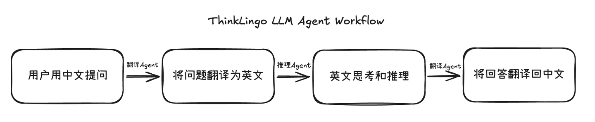

<div align="center">

# ThinkLingo：打破语言壁垒的 LLM 推理引擎

**母语提问，英语推理 —— 告别非英语“降智”，释放大模型 100% 的推理潜能。**

[](LICENSE)
[](https://www.python.org/)
[](https://react.dev/)
[](https://fastapi.tiangolo.com/)
[](https://www.docker.com/)

[English](README_EN.md) | **中文** | [日本語](README_JA.md) | [한국어](README_KO.md)

</div>


> [!Important]
> 🎉 **ThinkLingo 现已正式上线！** 
> 访问 [thinklingo.yizesun.com](https://thinklingo.yizesun.com) 即可开箱体验，无需任何部署。

---

## 为什么需要 ThinkLingo？

**痛点：** 众所周知，主流大语言模型（LLM）的训练数据以英文为主。当你使用非英语（如中文、日语）向模型提出复杂的逻辑、代码或数学问题时，模型的推理能力往往会大打折扣，甚至出现“降智”现象。

**解决方案：** ThinkLingo 巧妙地解决了这一问题。它会在后台自动将你的输入翻译为模型最擅长的“处理语言”（默认英语），让模型在最佳状态下完成深度推理，最后再将高质量的答案无缝翻译回你的母语。

### 核心优势

- **突破性能瓶颈**：无论你使用什么语言提问，都能获得等同于原生英语 Prompt 的顶级推理质量。
- **极致性价比（双模型架构）**：你可以配置一个“便宜且快速”的模型（如 GPT-4o-mini）专门负责翻译，搭配一个“强大但昂贵”的模型（如 DeepSeek-Reasoner / Claude 3.5 Sonnet）专门负责硬核推理，在保证质量的同时大幅降低 API 成本。
- **过程全透明**：独创的双栏 UI 设计。左侧展示模型原生的推理过程（含思维链），右侧展示母语翻译，让你不仅能看懂结果，还能随时审查模型的思考逻辑。

**工作流演示：**


---

## 使用指南

<table>
<tr>
<td width="50%">


</td>
<td width="50%">


</td>
</tr>
<tr>
<td align="center"><b>模型自由组合</b><br/>双 LLM 架构，推理与翻译模型自由搭配，兼顾质量与成本。支持 DeepSeek、OpenAI、Claude、Gemini、Qwen。</td>
<td align="center"><b>语言选择</b><br/>支持中文、英语、日语、韩语，自由切换源语言与处理语言，UI 随语言自动本地化。</td>
</tr>
<tr>
<td width="50%">


</td>
<td width="50%">


</td>
</tr>
<tr>
<td align="center"><b>系统主题切换</b><br/>内置不同主题风格，明暗模式一键切换，打造个性化的跨语言对话体验。</td>
<td align="center"><b>智能提示词路由</b><br/>自动判断问题类型（代码调试、数学求解、创意写作等），动态生成专业的 System Prompt。</td>
</tr>
</table>

---

## 快速开始

### 方案一：Docker 部署（推荐）

**前置条件：** 已安装 [Docker](https://www.docker.com/) 和 [Docker Compose](https://docs.docker.com/compose/)。

```bash
# 1. 克隆仓库
git clone https://github.com/Sun-Yize/ThinkLingo.git
cd ThinkLingo

# 2. 一键启动
docker-compose up -d
```

启动后，打开浏览器访问 **<http://localhost:3000>**。首次访问时，UI 会引导您配置 API 密钥。

> **常用维护命令：**
> - `docker-compose logs -f` ：查看实时日志
> - `docker-compose down` ：停止并移除容器
> - `docker-compose up -d --build` ：代码更改后重新构建

---

### 方案二：本地源码运行

**前置条件：** Python 3.11+、Node.js 18+。

```bash
# 1. 克隆并准备配置文件
git clone https://github.com/Sun-Yize/ThinkLingo.git
cd ThinkLingo
cp .env.template .env

# 2. 运行启动脚本
bash start.sh
```
脚本会自动安装依赖，并在 `8000` 端口启动后端，`3000` 端口启动前端。按 `Ctrl+C` 即可停止所有服务。

<details>
<summary>手动分步启动（不使用脚本）</summary>

```bash
# 终端 1 — 后端
pip install -r requirements.txt
uvicorn backend.app:app --reload --port 8000

# 终端 2 — 前端
cd frontend
npm install
npm start
```

</details>

---

## 支持的 LLM 提供商

ThinkLingo 采用**双 LLM 架构**，您可以自由组合“推理”与“翻译”模型：

| 提供商 | 推理模型 | 翻译模型 | API 密钥环境变量 |
|---|---|---|---|
| DeepSeek | `deepseek-chat`、`deepseek-reasoner` | `deepseek-chat` | `DEEPSEEK_API_KEY` |
| OpenAI | `gpt-4o`、`gpt-4o-mini`、`o3-mini` | `gpt-3.5-turbo`、`gpt-4o-mini` | `OPENAI_API_KEY` |
| Anthropic | `claude-opus-4-6`、`claude-sonnet-4-5` | `claude-haiku-4-5` | `ANTHROPIC_API_KEY` |
| Google | `gemini-3.1-pro-preview`、`gemini-2.5-pro` | `gemini-2.5-flash`、`gemini-2.5-flash-lite` | `GOOGLE_API_KEY` |
| 阿里巴巴（通义千问） | `qwen-plus`、`qwen3-max`、`qwen3-max-thinking` | `qwen-turbo`、`qwen-plus` | `QWEN_API_KEY` |

用户也可以在前端界面中为当前会话提供自己的 API 密钥（需设置 `ALLOW_USER_API_KEYS=true`）。

---

## 配置说明

所有配置项均在 `.env` 文件中（从 `.env.template` 复制）：

```bash
# ── API 密钥（至少需要一个）─────────────────────────
DEEPSEEK_API_KEY=...
OPENAI_API_KEY=...
ANTHROPIC_API_KEY=...       # 同时支持 ANTHROPIC_AUTH_TOKEN（OAuth 认证）
GOOGLE_API_KEY=...
QWEN_API_KEY=...

# ── 提供商选择 ──────────────────────────────────────
# 支持: deepseek | openai | claude | gemini | qwen
DEFAULT_LLM_PROVIDER=deepseek       # 推理模型
TRANSLATION_LLM_PROVIDER=openai     # 翻译模型

# ── 模型名称 ────────────────────────────────────────
DEEPSEEK_MODEL=deepseek-chat
OPENAI_MODEL=gpt-4o-mini
CLAUDE_MODEL=claude-opus-4-6
GEMINI_MODEL=gemini-3.1-pro-preview
QWEN_MODEL=qwen-plus

# ── 运行时配置 ──────────────────────────────────────
DEFAULT_TEMPERATURE=0.7
MAX_TOKENS=4000
MAX_HISTORY_TURNS=20
MAX_WORKERS=40               # 阻塞式 LLM 调用的线程池大小

# ── 安全设置 ────────────────────────────────────────
ALLOW_USER_API_KEYS=true     # 允许用户通过 UI 提供自己的密钥
# AUTH_TOKEN=...             # 保护所有端点（Bearer Token）
SESSION_TTL_SECONDS=3600     # 动态会话令牌有效期
MAX_SESSIONS_PER_IP_PER_HOUR=0   # 0 = 不限制
DAILY_MESSAGE_QUOTA_PER_IP=0     # 0 = 不限制

# ── WebSocket 限制 ─────────────────────────────────
MAX_WS_CONNECTIONS=200
MAX_WS_CONNECTIONS_PER_IP=5
WS_RATE_LIMIT_PER_SEC=5

# ── CORS ────────────────────────────────────────────
CORS_ORIGINS=http://localhost:3000

# ── 通义千问区域端点（可选）────────────────────────
# QWEN_BASE_URL=https://dashscope-intl.aliyuncs.com/compatible-mode/v1
```

> **省钱秘籍**：推荐使用 `DeepSeek-Reasoner` 或 `Claude 3.5 Sonnet` 作为推理模型，搭配 `GPT-4o-mini` 或 `Gemini 2.5 Flash` 作为翻译模型。这样既能获得最顶级的逻辑能力，又能将翻译成本降至最低。

---

## 技术栈

| 层级 | 技术 |
|---|---|
| 前端 | React 18、TypeScript、Tailwind CSS |
| 后端 | FastAPI、Python 3.11、uvicorn |
| 流式传输 | WebSocket（实时 token 流式传输） |
| LLM 提供商 | DeepSeek、OpenAI、Anthropic/Claude、Google/Gemini、阿里巴巴/通义千问 |
| 反向代理 | nginx |
| 部署 | Docker + Docker Compose |

---

## 项目结构

```
ThinkLingo/
├── backend/
│   ├── app.py                           # FastAPI 入口 + WebSocket + 认证 + 限流
│   ├── orchestrator/
│   │   └── translation_orchestrator.py  # 四步流水线协调器
│   ├── agents/
│   │   ├── translator_agent.py          # 语言检测与翻译（代码块保护）
│   │   └── questioner_agent.py          # 处理语言推理（5 种回复类型）
│   ├── llms/
│   │   ├── base.py                      # 抽象 LLM 接口
│   │   ├── deepseek_llm.py             # DeepSeek（支持思维链）
│   │   ├── openai_llm.py
│   │   ├── claude_llm.py               # API 密钥 + OAuth 双重认证
│   │   ├── gemini_llm.py
│   │   └── qwen_llm.py                 # 区域端点 + 思考模型
│   ├── prompt_router/
│   │   ├── models.py                    # PromptTemplate 数据类
│   │   ├── registry.py                  # 从 JSON 加载 15+ 模板
│   │   ├── router.py                    # 基于 LLM 的意图分类
│   │   └── templates.json               # 专业提示模板
│   └── utils/
│       ├── config.py                    # 类型化配置加载器 + 验证
│       ├── llm_factory.py              # LLM 工厂（服务端 + 按请求创建）
│       └── language_config.py           # 支持的语言列表
├── frontend/
│   ├── src/
│   │   ├── components/
│   │   │   ├── TranslationChat.tsx      # 主编排器（WebSocket、状态、流式传输）
│   │   │   ├── DualColumnView.tsx       # 响应式双栏布局
│   │   │   ├── TurnRow.tsx              # 会话轮次（思考 + 路由区块）
│   │   │   ├── MessageBubble.tsx        # 消息渲染器（Markdown、代码复制）
│   │   │   ├── InputBar.tsx             # 输入文本框（支持 IME）
│   │   │   ├── ChatHistory.tsx          # 侧边栏会话管理器
│   │   │   ├── SettingsModal.tsx        # 语言、回复类型、路由开关
│   │   │   └── ApiConfigModal.tsx       # 按角色配置 LLM 提供商/模型/密钥
│   │   ├── types/chat.ts               # TypeScript 接口
│   │   └── utils/i18n.ts               # UI 翻译（英/中/日/韩）
│   ├── Dockerfile                       # 多阶段构建（Node → nginx）
│   ├── nginx-frontend.conf              # 内部 nginx SPA 路由配置
│   └── tailwind.config.js               # 自定义 void 主题 + 毛玻璃效果
├── nginx/
│   ├── nginx-local.conf                 # 本地 Docker 配置（HTTP）
│   └── nginx.conf                       # 生产环境配置（HTTPS + 限流）
├── tools/
│   └── bench_qwen.py                   # 通义千问模型基准测试工具
├── start.sh                             # 一键本地启动脚本
├── docker-compose.yml                   # 本地部署
├── docker-compose.prod.yml              # 生产环境覆盖配置（HTTPS、子路径）
├── Dockerfile                           # 后端镜像（python:3.11-slim）
└── .env.template                        # 配置模板
```

---

## API 端点

### REST

| 端点 | 方法 | 描述 |
|---|---|---|
| `/api/health` | GET | 健康检查与编排器状态 |
| `/api/languages` | GET | 获取支持的语言列表 |
| `/api/response-types` | GET | 获取回复类型列表（通用、创意、分析、教育、技术） |
| `/api/session` | POST | 创建短期会话令牌（按 IP 限流） |
| `/api/quota` | GET | 获取当前 IP 的每日消息剩余配额 |
| `/api/config` | GET | 功能标志和可用的服务端配置提供商 |
| `/api/generate-title` | POST | 根据首条消息生成会话标题 |

### WebSocket

| 端点 | 协议 | 描述 |
|---|---|---|
| `/ws/chat` | WebSocket | 四步工作流的流式对话，支持提示路由和思维链展示 |

---

## 参与贡献

我们非常欢迎任何形式的贡献！无论是提交 Bug、增加新的 LLM 渠道，还是优化前端 UI：
- **新增 LLM**：继承 `backend/llms/base.py`，并在 `backend/utils/llm_factory.py` 和前端 `ApiConfigModal.tsx` 中注册。
- **新增语言**：更新 `backend/utils/language_config.py` 及前端 `frontend/src/utils/i18n.ts`。
- **新增提示词模板**：直接在 `backend/prompt_router/templates.json` 中配置即可。

---

## 许可证

本项目基于 [AGPL-3.0 License](LICENSE) 开源。
