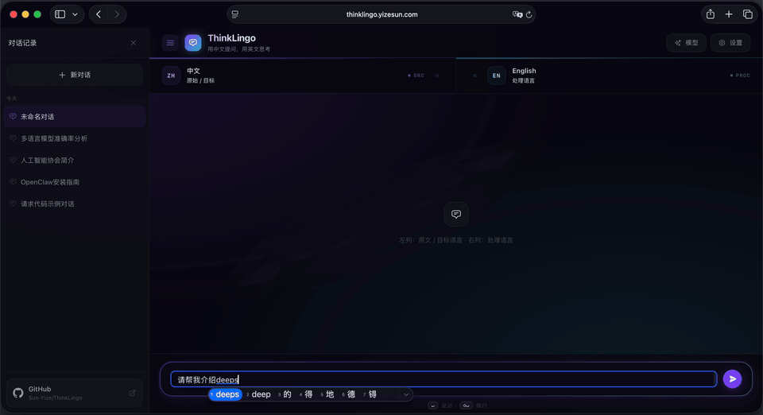

<div align="center">

# ThinkLingo: 언어 장벽을 허무는 LLM 추론 엔진

**모국어로 질문하고, 영어로 추론한다 — 비영어권 "성능 저하"를 해소하고 대규모 언어 모델의 추론 잠재력을 100% 끌어냅니다.**



[](LICENSE)
[](https://www.python.org/)
[](https://react.dev/)
[](https://fastapi.tiangolo.com/)
[](https://www.docker.com/)

[English](README_EN.md) | [中文](README.md) | [日本語](README_JA.md) | [**한국어**](README_KO.md)

</div>

> [!Important]
> 🎉 **ThinkLingo가 정식 출시되었습니다!**
> [thinklingo.yizesun.com](https://thinklingo.yizesun.com)에서 별도 설치 없이 바로 체험해 보세요.

---

## 왜 ThinkLingo가 필요한가요?

**문제점:** 잘 알려진 것처럼, 주요 대규모 언어 모델(LLM)의 학습 데이터는 대부분 영어입니다. 비영어권 언어(한국어, 중국어, 일본어 등)로 복잡한 논리, 코드, 수학 문제를 질문하면 모델의 추론 능력이 크게 저하되는 이른바 "성능 저하" 현상이 발생합니다.

**해결책:** ThinkLingo는 이 문제를 깔끔하게 해결합니다. 사용자의 입력을 백그라운드에서 모델이 가장 잘 처리하는 "처리 언어"(기본값: 영어)로 자동 번역하여, 모델이 최적의 상태에서 심층 추론을 수행한 뒤, 고품질 답변을 사용자의 모국어로 매끄럽게 재번역하여 전달합니다.

### 핵심 장점

- **성능 한계 돌파**: 어떤 언어로 질문하든, 영어 네이티브 프롬프트와 동등한 최고 수준의 추론 품질을 얻을 수 있습니다.
- **극대화된 비용 효율(듀얼 모델 아키텍처)**: "저렴하고 빠른" 모델(예: GPT-4o-mini)을 번역 전담으로, "강력하지만 고가인" 모델(예: DeepSeek-Reasoner / Claude 3.5 Sonnet)을 핵심 추론 전담으로 조합하여, 품질을 유지하면서 API 비용을 대폭 절감할 수 있습니다.
- **처리 과정 완전 투명**: 독자적인 이중 컬럼 UI 디자인으로, 왼쪽에는 모델의 원어 추론 과정(사고 사슬 포함)을, 오른쪽에는 모국어 번역을 표시합니다. 결과뿐 아니라 모델의 사고 논리까지 언제든 검토할 수 있습니다.

**워크플로 데모:**


---

## 사용 가이드

<table>
<tr>
<td width="50%">


</td>
<td width="50%">


</td>
</tr>
<tr>
<td align="center"><b>모델 자유 조합</b><br/>듀얼 LLM 아키텍처로 추론 모델과 번역 모델을 자유롭게 조합하여 품질과 비용을 최적화합니다. DeepSeek, OpenAI, Claude, Gemini, Qwen을 지원합니다.</td>
<td align="center"><b>언어 선택</b><br/>중국어, 영어, 일본어, 한국어를 지원합니다. 소스 언어와 처리 언어를 자유롭게 전환하며, UI가 자동으로 현지화됩니다.</td>
</tr>
<tr>
<td width="50%">


</td>
<td width="50%">


</td>
</tr>
<tr>
<td align="center"><b>테마 전환</b><br/>다양한 테마를 내장하고 있으며, 라이트/다크 모드를 원클릭으로 전환하여 개성 있는 다국어 대화 경험을 제공합니다.</td>
<td align="center"><b>스마트 프롬프트 라우팅</b><br/>내장된 의도 인식 기능이 질문 유형(코드 디버깅, 수학 풀이, 창작 글쓰기 등)을 자동으로 판별하고, 전문화된 System Prompt를 동적으로 적용합니다.</td>
</tr>
</table>

---

## 빠른 시작

### 방법 1: Docker 배포(권장)

**사전 요구 사항:** [Docker](https://www.docker.com/)와 [Docker Compose](https://docs.docker.com/compose/)가 설치되어 있어야 합니다.

```bash
# 1. 저장소 클론
git clone https://github.com/Sun-Yize/ThinkLingo.git
cd ThinkLingo

# 2. 원클릭 실행
docker-compose up -d
```

실행 후 브라우저에서 **<http://localhost:3000>**에 접속하세요. 첫 방문 시 UI에서 API 키 설정을 안내합니다.

> **자주 사용하는 관리 명령어:**
> - `docker-compose logs -f` : 실시간 로그 확인
> - `docker-compose down` : 컨테이너 중지 및 삭제
> - `docker-compose up -d --build` : 코드 변경 후 재빌드

---

### 방법 2: 로컬 소스 코드 실행

**사전 요구 사항:** Python 3.11+, Node.js 18+.

```bash
# 1. 클론 및 설정 파일 준비
git clone https://github.com/Sun-Yize/ThinkLingo.git
cd ThinkLingo
cp .env.template .env

# 2. 시작 스크립트 실행
bash start.sh
```
스크립트가 자동으로 의존성을 설치하고, 백엔드를 `8000` 포트에, 프론트엔드를 `3000` 포트에 기동합니다. `Ctrl+C`를 누르면 모든 서비스가 중지됩니다.

<details>
<summary>수동 단계별 시작(스크립트 미사용)</summary>

```bash
# 터미널 1 — 백엔드
pip install -r requirements.txt
uvicorn backend.app:app --reload --port 8000

# 터미널 2 — 프론트엔드
cd frontend
npm install
npm start
```

</details>

---

## 지원 LLM 제공사

ThinkLingo는 **듀얼 LLM 아키텍처**를 채택하여 "추론"과 "번역" 모델을 자유롭게 조합할 수 있습니다.

| 제공사 | 추론 모델 | 번역 모델 | API 키 환경 변수 |
|---|---|---|---|
| DeepSeek | `deepseek-chat`, `deepseek-reasoner` | `deepseek-chat` | `DEEPSEEK_API_KEY` |
| OpenAI | `gpt-4o`, `gpt-4o-mini`, `o3-mini` | `gpt-3.5-turbo`, `gpt-4o-mini` | `OPENAI_API_KEY` |
| Anthropic | `claude-opus-4-6`, `claude-sonnet-4-5` | `claude-haiku-4-5` | `ANTHROPIC_API_KEY` |
| Google | `gemini-3.1-pro-preview`, `gemini-2.5-pro` | `gemini-2.5-flash`, `gemini-2.5-flash-lite` | `GOOGLE_API_KEY` |
| Alibaba (Qwen) | `qwen-plus`, `qwen3-max`, `qwen3-max-thinking` | `qwen-turbo`, `qwen-plus` | `QWEN_API_KEY` |

사용자는 프론트엔드 인터페이스에서 현재 세션용 API 키를 직접 입력할 수도 있습니다(`ALLOW_USER_API_KEYS=true` 설정 필요).

---

## 설정 안내

모든 설정 항목은 `.env` 파일에서 관리합니다(`.env.template`에서 복사):

```bash
# ── API 키(최소 하나 필요) ─────────────────────────
DEEPSEEK_API_KEY=...
OPENAI_API_KEY=...
ANTHROPIC_API_KEY=...       # ANTHROPIC_AUTH_TOKEN(OAuth 인증)도 지원
GOOGLE_API_KEY=...
QWEN_API_KEY=...

# ── 제공사 선택 ──────────────────────────────────────
# 지원: deepseek | openai | claude | gemini | qwen
DEFAULT_LLM_PROVIDER=deepseek       # 추론 모델
TRANSLATION_LLM_PROVIDER=openai     # 번역 모델

# ── 모델명 ────────────────────────────────────────────
DEEPSEEK_MODEL=deepseek-chat
OPENAI_MODEL=gpt-4o-mini
CLAUDE_MODEL=claude-opus-4-6
GEMINI_MODEL=gemini-3.1-pro-preview
QWEN_MODEL=qwen-plus

# ── 런타임 설정 ──────────────────────────────────────
DEFAULT_TEMPERATURE=0.7
MAX_TOKENS=4000
MAX_HISTORY_TURNS=20
MAX_WORKERS=40               # 블로킹 LLM 호출용 스레드 풀 크기

# ── 보안 설정 ────────────────────────────────────────
ALLOW_USER_API_KEYS=true     # 사용자가 UI를 통해 자신의 키를 제공할 수 있도록 허용
# AUTH_TOKEN=...             # 모든 엔드포인트 보호(Bearer Token)
SESSION_TTL_SECONDS=3600     # 동적 세션 토큰 유효 기간
MAX_SESSIONS_PER_IP_PER_HOUR=0   # 0 = 제한 없음
DAILY_MESSAGE_QUOTA_PER_IP=0     # 0 = 제한 없음

# ── WebSocket 제한 ─────────────────────────────────
MAX_WS_CONNECTIONS=200
MAX_WS_CONNECTIONS_PER_IP=5
WS_RATE_LIMIT_PER_SEC=5

# ── CORS ────────────────────────────────────────────
CORS_ORIGINS=http://localhost:3000

# ── Qwen 리전 엔드포인트(선택 사항) ────────────────
# QWEN_BASE_URL=https://dashscope-intl.aliyuncs.com/compatible-mode/v1
```

> **비용 절감 팁**: 추론 모델로는 `DeepSeek-Reasoner` 또는 `Claude 3.5 Sonnet`을, 번역 모델로는 `GPT-4o-mini` 또는 `Gemini 2.5 Flash`를 추천합니다. 이렇게 하면 최고 수준의 논리력을 확보하면서 번역 비용을 최소화할 수 있습니다.

---

## 기술 스택

| 계층 | 기술 |
|---|---|
| 프론트엔드 | React 18, TypeScript, Tailwind CSS |
| 백엔드 | FastAPI, Python 3.11, uvicorn |
| 스트리밍 | WebSocket(실시간 토큰 스트리밍) |
| LLM 제공사 | DeepSeek, OpenAI, Anthropic/Claude, Google/Gemini, Alibaba/Qwen |
| 리버스 프록시 | nginx |
| 배포 | Docker + Docker Compose |

---

## 프로젝트 구조

```
ThinkLingo/
├── backend/
│   ├── app.py                           # FastAPI 엔트리 포인트 + WebSocket + 인증 + 레이트 리미팅
│   ├── orchestrator/
│   │   └── translation_orchestrator.py  # 4단계 파이프라인 오케스트레이터
│   ├── agents/
│   │   ├── translator_agent.py          # 언어 감지 및 번역(코드 블록 보호)
│   │   └── questioner_agent.py          # 처리 언어 추론(5가지 응답 유형)
│   ├── llms/
│   │   ├── base.py                      # 추상 LLM 인터페이스
│   │   ├── deepseek_llm.py             # DeepSeek(사고 사슬 지원)
│   │   ├── openai_llm.py
│   │   ├── claude_llm.py               # API 키 + OAuth 이중 인증
│   │   ├── gemini_llm.py
│   │   └── qwen_llm.py                 # 리전 엔드포인트 + 씽킹 모델
│   ├── prompt_router/
│   │   ├── models.py                    # PromptTemplate 데이터 클래스
│   │   ├── registry.py                  # JSON에서 15+ 템플릿 로드
│   │   ├── router.py                    # LLM 기반 의도 분류
│   │   └── templates.json               # 전문 프롬프트 템플릿
│   └── utils/
│       ├── config.py                    # 타입 기반 설정 로더 + 검증
│       ├── llm_factory.py              # LLM 팩토리(서버 측 + 요청별 생성)
│       └── language_config.py           # 지원 언어 목록
├── frontend/
│   ├── src/
│   │   ├── components/
│   │   │   ├── TranslationChat.tsx      # 메인 오케스트레이터(WebSocket, 상태, 스트리밍)
│   │   │   ├── DualColumnView.tsx       # 반응형 이중 컬럼 레이아웃
│   │   │   ├── TurnRow.tsx              # 대화 턴(씽킹 + 라우팅 블록)
│   │   │   ├── MessageBubble.tsx        # 메시지 렌더러(Markdown, 코드 복사)
│   │   │   ├── InputBar.tsx             # 입력 텍스트 영역(IME 지원)
│   │   │   ├── ChatHistory.tsx          # 사이드바 대화 관리자
│   │   │   ├── SettingsModal.tsx        # 언어, 응답 유형, 라우팅 토글
│   │   │   └── ApiConfigModal.tsx       # 역할별 LLM 제공사/모델/키 설정
│   │   ├── types/chat.ts               # TypeScript 인터페이스
│   │   └── utils/i18n.ts               # UI 번역(영/중/일/한)
│   ├── Dockerfile                       # 멀티 스테이지 빌드(Node → nginx)
│   ├── nginx-frontend.conf              # 내부 nginx SPA 라우팅 설정
│   └── tailwind.config.js               # 커스텀 void 테마 + 글래스모피즘
├── nginx/
│   ├── nginx-local.conf                 # 로컬 Docker 설정(HTTP)
│   └── nginx.conf                       # 프로덕션 설정(HTTPS + 레이트 리미팅)
├── tools/
│   └── bench_qwen.py                   # Qwen 모델 벤치마크 도구
├── start.sh                             # 원클릭 로컬 시작 스크립트
├── docker-compose.yml                   # 로컬 배포
├── docker-compose.prod.yml              # 프로덕션 오버라이드 설정(HTTPS, 서브패스)
├── Dockerfile                           # 백엔드 이미지(python:3.11-slim)
└── .env.template                        # 설정 템플릿
```

---

## API 엔드포인트

### REST

| 엔드포인트 | 메서드 | 설명 |
|---|---|---|
| `/api/health` | GET | 헬스 체크 및 오케스트레이터 상태 |
| `/api/languages` | GET | 지원 언어 목록 조회 |
| `/api/response-types` | GET | 응답 유형 목록 조회(일반, 창작, 분석, 교육, 기술) |
| `/api/session` | POST | 단기 세션 토큰 생성(IP별 레이트 리미팅) |
| `/api/quota` | GET | 현재 IP의 일일 메시지 잔여 할당량 조회 |
| `/api/config` | GET | 기능 플래그 및 서버에 설정된 제공사 정보 |
| `/api/generate-title` | POST | 첫 번째 메시지를 기반으로 대화 제목 생성 |

### WebSocket

| 엔드포인트 | 프로토콜 | 설명 |
|---|---|---|
| `/ws/chat` | WebSocket | 4단계 워크플로 스트리밍 대화, 프롬프트 라우팅 및 사고 사슬 표시 지원 |

---

## 기여하기

어떤 형태의 기여든 환영합니다! 버그 제보, 새로운 LLM 제공사 추가, 프론트엔드 UI 개선 등 무엇이든 좋습니다.
- **LLM 추가**: `backend/llms/base.py`를 상속하고, `backend/utils/llm_factory.py` 및 프론트엔드 `ApiConfigModal.tsx`에 등록하세요.
- **언어 추가**: `backend/utils/language_config.py`와 프론트엔드 `frontend/src/utils/i18n.ts`를 업데이트하세요.
- **프롬프트 템플릿 추가**: `backend/prompt_router/templates.json`에 항목을 추가하면 됩니다.

---

## 라이선스

이 프로젝트는 [AGPL-3.0 License](LICENSE)에 따라 공개되어 있습니다.
